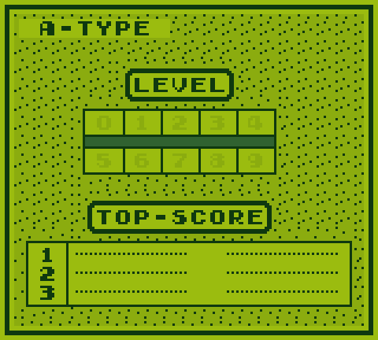

# my_gb

A Game Boy (DMG) emulator written in C++20.

[](https://squigglekernel.github.io/my_gb/)

**[Run it in the browser](https://squigglekernel.github.io/my_gb/)** - the
WebAssembly build, rebuilt from `main` on every push. Pick a `.gb` file from
your own disk; no ROMs are bundled.

The core has no UI dependencies. Memory accesses tick the bus four T-cycles
before they resolve, so instruction and memory timing fall out of where the
accesses sit rather than out of a cycle table.

## Building

```
cmake -B build -G Ninja
cmake --build build
```

SDL3 is needed for the desktop frontend; turn it off with `-DGB_BUILD_SDL3=OFF`
to build just the core and the tests. Other targets are opt-in:
`-DGB_BUILD_LIBRETRO=ON`, `-DGB_BUILD_WASM=ON`, `-DGB_SANITIZE=ON`.

```
./build/src/frontend/sdl3/gb_sdl3 game.gb
```

Arrow keys, Z and X for A and B, Enter for start, right shift for select.

The WebAssembly build needs emsdk in `third_party/`:

```
git clone https://github.com/emscripten-core/emsdk.git third_party/emsdk
(cd third_party/emsdk && ./emsdk install latest && ./emsdk activate latest)
./tools/build_wasm.sh
```

## Tests

Test ROMs are not vendored. Fetch them once:

```
python3 tools/fetch_test_roms.py
```

Then:

```
ctest --test-dir build --output-on-failure
```

`gb_acceptance` runs the ROM suites directly and takes `--filter`,
`--dump-png` and `--timeout-frames`. Blargg suites that report over the serial
port are read from there; the ones that only draw to the LCD are read by
matching the result word in the framebuffer.

## Accuracy

| Suite | |
|---|---|
| blargg cpu_instrs | 12/12 |
| blargg instr_timing | pass |
| blargg mem_timing, mem_timing-2 | 4/4, 4/4 |
| blargg halt_bug | pass |
| blargg dmg_sound | 9/12 |
| blargg oam_bug | 7/8 |
| dmg-acid2 | pixel-identical to the reference |
| mooneye | 82/115 |

Twenty of the mooneye ROMs that do not pass are asking a question a DMG cannot
answer: the SGB, CGB, AGB, MGB and DMG0 boot tests check register values this
model never has, `utils/` holds tools rather than tests, and `manual-only` has
to be looked at. The suite still counts them, so 82/115 understates it; the
failures worth chasing are the eighteen below.

Eight of those are the PPU: `intr_2_*`, `lcdon_*`, `stat_lyc_onoff` and
`vblank_stat_intr` all turn on when a mode change becomes visible in STAT
relative to the interrupt it raises, which is a dot-level question the current
mode-boundary model does not answer. Mode 3 does now stretch for objects and
the window, which is a prerequisite for those, but on its own moves none of
them.

The three failing sound tests cover wave RAM access while channel 3 is playing,
which needs the CPU access to resolve at a known offset inside the M-cycle. The
three `boot_*-dmgABCmgb` tests and `boot_sclk_align` want the exact machine
state a real boot ROM leaves behind. `oam_dma_start`, `rapid_toggle` and
`oam_bug/7-timing_effect` are each a cycle off somewhere of their own.
